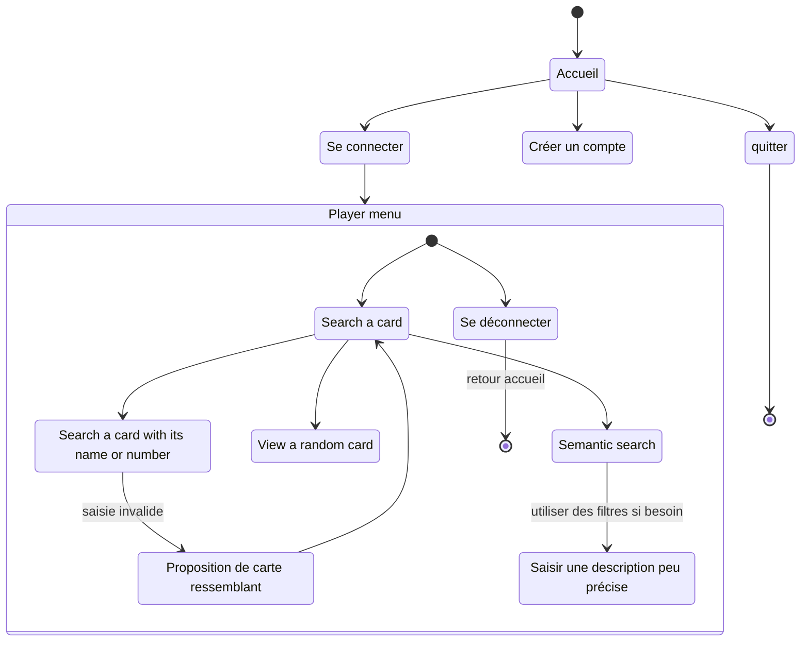

# Diagramme d'activité

> Un diagramme UML d'activité modélise le flux de travail d'un processus, montrant la séquence d'activités et de décisions dans un système. Il illustre comment les actions s'enchaînent et comment les choix sont faits.

Ce diagramme est codé avec [mermaid](https://mermaid.js.org/syntax/stateDiagram.html) :

- avantage : facile à coder
- inconvénient : on ne maîtrise pas bien l'affichage

Pour afficher ce diagramme dans VScode :

- à gauche aller dans **Extensions** (ou CTRL + SHIFT + X)
- rechercher `mermaid`
  - installer l'extension **Markdown Preview Mermaid Support**
- revenir sur ce fichier
  - faire **CTRL + K**, puis **V**

https://mermaid.live/edit#pako:eNp1VNuO2jAQ_ZWRHysWkQWSxQ8rVdsPqLRSH1oqZOIBXCV26ku3W8QH9Tv6Y504CTEsy5Nnzjkzx_ERR1YaiYwz54XHT0rsrajXGuhXow6bHyZgsMDhcyVe0cZmBzsUtjxsSmElwc-xAgFt_Yaw0aLGaxa8KH8A5R1E1FjQod6iHdS10F6Vm25MFHedfnBHs0KaejDxReELDbdCUzNx0ljTGKe8MpouMhYgsWV5BIuOFm4rWnBz_UaiK61qogr4s1BOWQgaIQUaDLTr399SOezGVGavdPQOpdEaSz_cjxDTIk_Ex3YUEerGk27Eg--kkkaO6g7_9uE73N09wseyDKiqod2XEYrLUx9tM3nVdzRG3wJ-BuXP5vsiAmSka64H3fkAMVQXQTp2QHqDJCf9IJ9m64oSozQOuWaOeXh_1mWwBt5gp_vw44b0NNzrZrxb8UXSXJsSBKV_iUrJxHTCevsF0g2XTm-4T3PJIXhVUfRsG0rYqcpTrMEp2KIz6sJ8eu6T1r8lt-gNPZQYctVSTpHfntmE7a2SjHsbcMJqtLVoSxYfds38Ael5GKejxJ0IlV-ztT6RrBH6qzH1oLQm7A-M70TlqAqNHP9-zl2LWqJ9MkF7xudZUcQpjB_Zb8Yfsukiz2d5dp_nD0W2Wk7YK-PZrJgu83yeETJfLpar7DRhf-Le2bS4L_IlAfkiK_LVIjv9B1iKoH0

