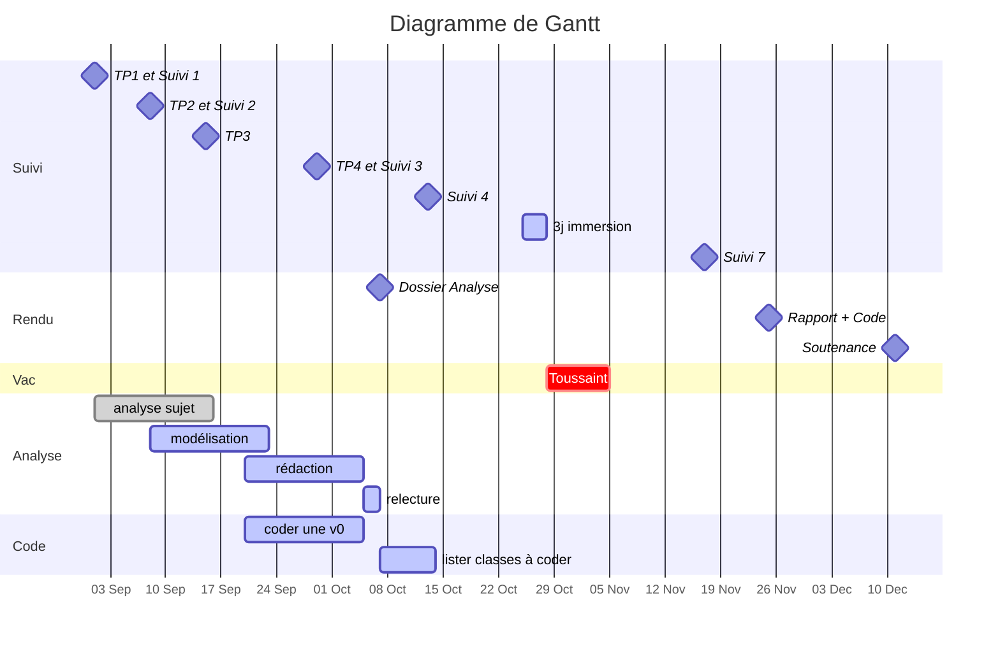

à utiliser avec **https://hackmd.io/**

# :clipboard:  Présentation du sujet

* **Sujet** : Application pour gérer une liste de joueurs et de joueuses
* **Tuteur / Tutrice** : Rick Auray (rick.auray@ensai.fr)
* [Dépôt GitHub](https://github.com/ludo2ne/ENSAI-projet-info-2A-template)

# :dart: Échéances

---
Dossier d'Analyse :  :clock1: <iframe src="https://free.timeanddate.com/countdown/i83zdl7u/n1264/cf11/cm0/cu2/ct4/cs0/ca0/co0/cr0/ss0/cac009/cpcf00/pcfff/tcfff/fs100/szw256/szh108/iso2023-10-07T12:00:00" allowtransparency="true" frameborder="0" width="130" height="16"></iframe>

---

# :calendar: Livrables

| Date    | Livrables                                                    |
| ------- | ------------------------------------------------------------ |
| 07 oct. | [Dossier d'Analyse](https://www.overleaf.com/)               |
| 25 nov. | Rapport final + code (:hammer_and_wrench:  [correcteur orthographe et grammaire](https://www.scribens.fr/))|
| 12 déc. | Soutenance                                                   |

# :construction: Todo List

## Dossier Analyse

* [x] Diagramme de Gantt
* [x] Diagramme de cas d'utilisation
* [x] Diagramme de classe
* [ ] Répartition des parties à rédiger

## Code

* [ ] Créer dépôt Git commun
  * [ ] vérifier que tout le monde peut **push** et **pull**
* [ ] Version 0 de l'application
  * coder une et une seule fonctionnalité simple de A à Z, et faire tourner l'appli
  * cela permettra à toute l'équipe d'avoir une bonne base de départ
* [ ] Lister classes et méthodes à coder

---

* [ ] appel WS
* [ ] création WS
* [ ] Vue inscription
* [ ] hacher mdp

---

